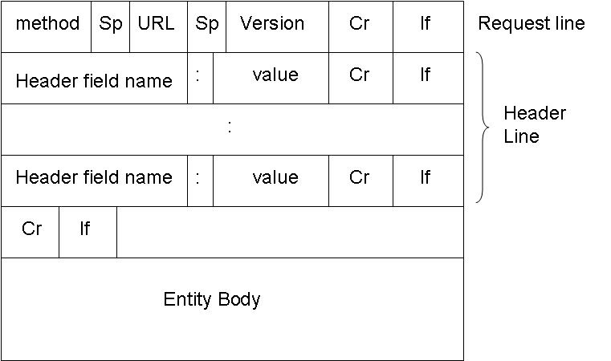
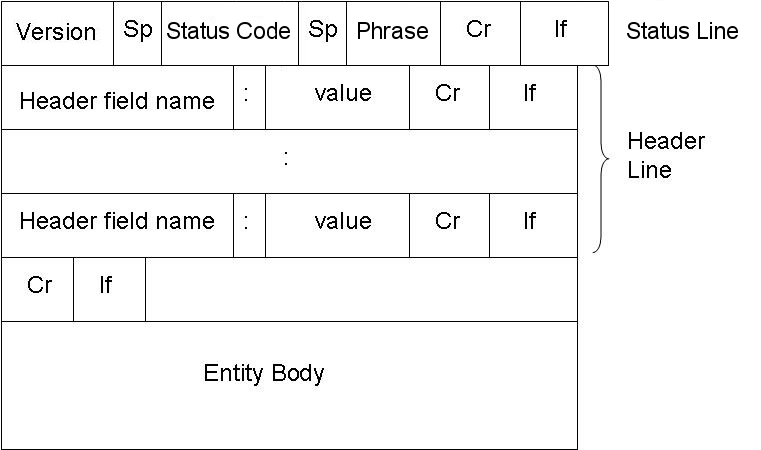
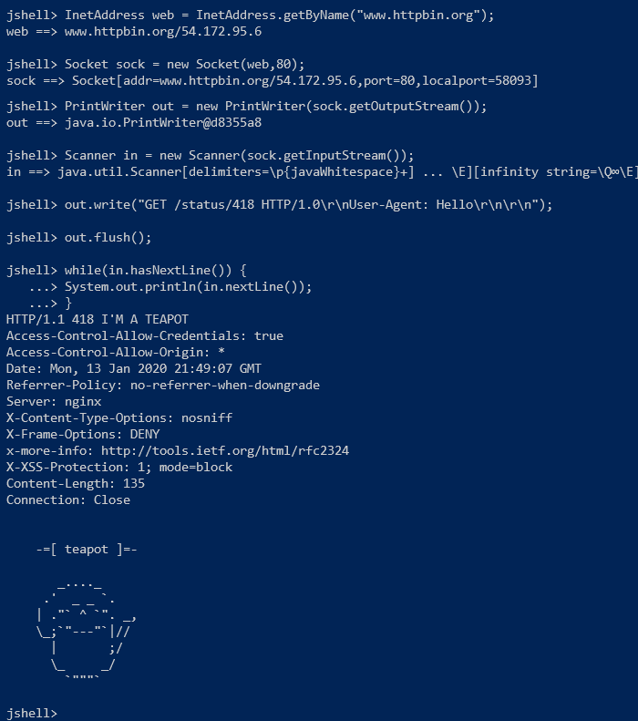

# COMP-445-LAB-1

## Legal Network Classes

```
//Blocking Classes
java.net.Socket
java.net.ServerSocket

//Non Blocking Classes
java.nio.channels.SelectionKey
java.nio.channels.Selector
java.nio.channels.ServerSocketChannel
java.nio.channels.SocketChannel
java.nio.ByteBuffer
java.nio.Files

//Misc Classes
java.net.InetAddress
java.net.InetSocketAddress
java.net.URL
java.net.URI
<other typical classes>
```

The following classes are **NOT** legal:
```
java.net.HttpUrlConnection
java.net.HttpsUrlConnection
java.net.UrlConnection
java.net.JarUrlConnection 
<any wrapper classes for sockets from github>
<any wrapper classes attempting to make a socket's use 'simpler'>
```

## Definition

### HTTP

HTTP (Hypertext Transfer Protocol) is a generic yet versatile application used to deliver and receive data between two communication endpoints.

It is primarily used in WWW (World Wide Web) through server-client relations.

For this class, we will primarily use and study HTTP version 1.0 due to its simplicity.


### Socket

A socket is a **logical interface** whose purpose is to be the endpoint of a two-way communication. It can send/receive data to/from another endpoint.

It does not need to be connected to another endpoint and one should definitely not associate sockets with the establishment of a connection/communication to/from another endpoint (see Port).

### Port

A port is a communication endpoint. When processes are bound or acquire a port, the port identifies these processes (such as SSH,HTTP,SMTP,etc...).

The distinguishing factor between Socket and Port is that a Socket is a logical interface used by programmers and are bound to specific ports. 

For this lab, we strictly focus on port 80.

## Importance of Standardization

```
Suppose Bob is a customer sitting in a restaurant and Alice is the waitress of that restaurant.

Bob browses through the menu and decides he wants a vegetarian pizza.

Bob closes his menu and waits for Alice to **serve** him.

When Alice approaches Bob, she greets him and asks him what he wants.

Bob tells her that he wants a vegetarian pizza.

Alice **acknowledges** his order and writes it down on a piece of paper.
```

In this scenario, Alice and Bob communicated their interest/intentions clearly:

- Bob's closing of the menu is a standard signal intended for Alice to know that he is ready to be served.

- Alice understood Bob's request for a vegetarian pizza because she knows her products.

Things to ask:

- Would Alice have understood Bob if he had said that he wants a number 10 (where the number refers to the vegetarian pizza)?

- If one of them didn't speak the other's language, would they have understood each other only through words?

Prior to asking the above questions, we can say that both Alice and Bob followed the standard procedure for communicating with one another.

There are many situations to think of that could have changed the outcome of this scenario. 

If we changed any of their behavior, we would deviate from the standard. (Example: If Alice did not speak the same language as Bob). 

It wouldn't be wrong to do so, but we have to ensure (through other methods) that we end up with a successful scenario.

In the context of HTTP, a client and a server should follow standards. 

Standards can be changed by deviating away from them, but we have to ensure that both parties understand what those changes are.

For the World Wide Web, if the HTTP client (Bob) decided to implement rules out of the standard (we'll see this later on) and the HTTP server (Alice) was following the standard, then neither would have understood each other.

For this reason, it is **important** to follow the standard HTTP structure and to respect it.


## Objective

The objective of this lab is to create an HTTP client using only Java to access contents of websites on the internet. To achieve the objective, four major concerns need to be addressed.


### HTTP Request Structure



Where:

```
Method:
	GET: Used to acquire data
	POST: Used to push data

URL: 
	Path of the request without the host
	Example: the URL field of www.httpbin.org/status/418 would be /status/418

Version:
	HTTP/1.0

Header field name & value:
	For both  GET and POST it can be anything
	For POST, must have at least Content-Length:<length of Entity Body>

Entity Body:
	GET: Nothing</p>
	POST: Can be Nothing or Something

Sp: Space character

Cr: Carriage return (\r)

Lf: Line feed (\n)
```

Concerns to handle:

- What if the method was neither GET nor POST?
- What if URL was bad?
- What if there are no headers? (hint: it's possible)
- What if there are duplicate headers?
- What if there is a body in a GET request?
- What if there are no body in a POST request?

These concerns need to be addressed. 

### HTTP Response Structure

Knowing that the client receives the server's response to their request, how does the client understand what the server is communicating?

This section is references when we need to parse the response a client receives from the server after it has read the data.



Where:

```
Version:
	Is copied from the client's Version field.

Phrase:
	200 : OK 
	-- Server successfully found the resource and has sent it back to the client.

	404 : Not Found 
	-- Server has not found anything matching the requested URI.
	-- For example, if the client wants /directory/hello.txt, and the server doesn't have it in /directory/hello.txt

	201 : Created 
	-- Server has successfully created a resource from a POST ONLY request.
	-- It is NOT mandatory to return a URI entity.

	400 : Bad Request 
	-- Server doesn't understand the request.
	-- For example, if the request doesn't follow proper syntax or is malformed.

	403 : Forbidden 
	-- Server understood the request, but refuses to 'service' it. 
	-- For example, if the file has it's permissions set to not Readable/Writeable

Header field name & value:
	Contains some headers used by the client, and adds new ones sometimes

Entity Body:
	Data provided to client
```

### Socket Utilization

A client socket is created by calling the constructor:

```
Socket(InetAddress addr,int port);
```

An InetAddress is an in java whose purpose (in our scope) is to map the hostname of a website to it's respective IP address:

```
InetAddress web = InetAddress.getByName("www.httpbin.org");
``` 

The port number is 80 for this lab.

Once the socket has been created, the streams can be acquired by calling the following methods:

```
Socket sock = new Socket(web,80);
PrintWriter out = new PrintWriter(socket.getOutputStream());
Scanner in = new Scanner(socket.getInputStream());
```

- The **out** PrintWriter object is responsible for writing to the other endpoint (from client to server).
- The **in** Scanner object is responsible for reading from the other endpoint (from server to client).

Knowing this, we can perform the following actions to get a response:

```
out.write("GET /status/418 HTTP/1.0\r\nUser-Agent: Hello\r\n\r\n");
out.flush();

while(in.hasNextLine()) {
	System.out.println(in.nextLine());
}

out.close();
in.close();
sock.close();
```



**IMPORTANT**: Although using PrintWriter and Scanner is acceptable, I recommend that you familiarize yourself with objects that use byte streams rather than text streams (Example: InputStreamReader/Writer)

**IMPORTANT**: This section is only concerned with socket creation and utilization, refer to the previous sections and the lab handout on the **proper** way to send and receive messages. There should be classes (and not just one big class doing everything!).

### Command-Line Interface

This section is self-explanatory. The design of the command line interface is described extensively in the lab handout and should be **followed** carefully.

The options (-d,-h,etc...) should be the same. 

In situations where the program identifies an illegal state, it should **not assume** one state over another. Example: -d and -f cannot be called at the same time. Therefore, stop program execution and print help. Do not make the program choose -d over -f or vice versa.

Things to handle:
- Unordering of the options (-d comes before -h).
- Options that require an argument (what happens if the argument is -h -h?)

### Helpful References

[WWW HTTP 1.0](https://www.w3.org/Protocols/HTTP/1.0/spec.html)

[Oracle Java Docs](https://docs.oracle.com/javase/7/docs/api/)


